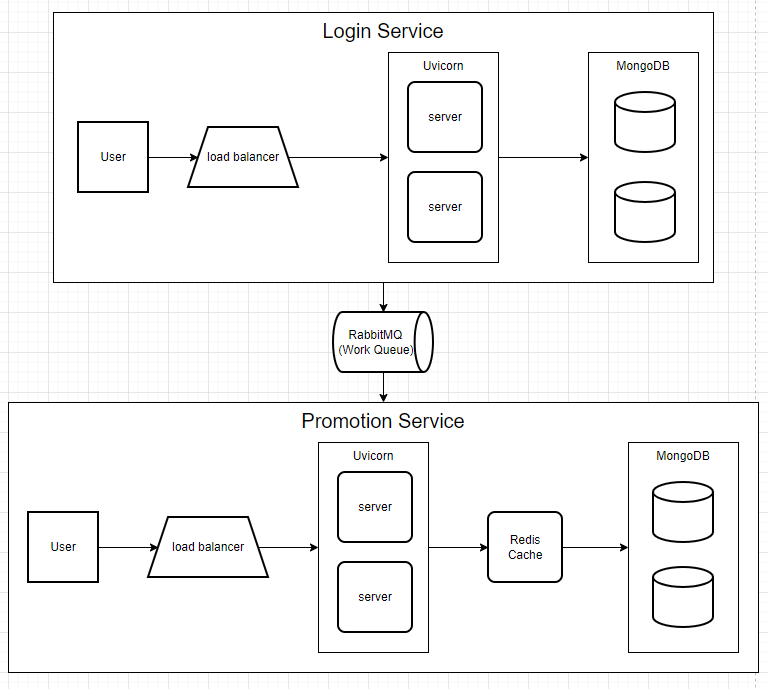

> **Note**: I assume two services are from two different repositories, which means I can't utilize the code of the other service, so that the code may be duplicated a few parts.

Table of Contents
=================

* [Requirements](#requirements)
* [Analysis and Assumptions](#analysis-and-assumptions)
* [Solution](#solution)
    * [System Architecture](#system-architecture)
    * [Technology Stack](#technology-stack)
* [Cases Can and Can't Handle](#cases-can-and-cant-handle)

Another document:
- [Implementation](docs/implementation.md)
- [Data Schema](docs/data_schema.md)
- [API Documentation](docs/api_documentation.md)

# Requirements
1. The login/create system:
    - User can create an account
    - User can login to their account
2. The promotion system:
    - The 100 first login users will get a 30% discount
    - This discount will be applied to the

# Analysis and Assumptions
- Because this is the service for the bank system, so I have some assumptions:
    - *One user can have only one account*, which means the username, email, and phone number must be unique.
    - *The session/token will be expired after 30 minutes*, for the security reason of the bank system.
    - Assume that the payload send to server on the sercure protocol (HTTPS).
- Based on the requirements and the assumptions, I have some analysis:
    - The number of users is not too much, so the system doesn't need to handle the request from the large number of users.
    - The number of messages is not too much, so the message queue doesn't need to handle the large number of messages.
    - The data is not shared between the users, so the cache system will not be effective in this case.
    - The data is not relational, so the NoSQL database is suitable for this case.
    - The number of read operations is much more than the number of write operations, so the database must be optimized for read operations.
# Solution

## System Architecture

- **Server**:
    - Scale the server horizontally by increase multiple servers and spawn multiple processers.
    - Use a load balancer to distribute the load to the servers.
- **MQ Consummer**:
    - It can be scaled horizontally by increase multiple servers and spawn multiple processers.
    - The queue broker of RabbitMQ will be the load balancer to distribute the message to the consumers.
- **Database**:
    - Scale the database horizontally by duplicating the read-only databases, because the number of read operations is much more than the number of write operations.
    - Use the load balancer to distribute the read request to the read-only databases.
    - We can also use sharding to scale the database to support if the number of users is become larger.
- **Message Queue**:
    - Use message queue (worker queue) to handle the message between the login service and promotion service.
    = Use only one queue with multiple consumers to handle the message concurrently.
- **No Cache**:
    - I don't use cache in these systems, because the data is not shared too much between the users, each user has their own data, so the cache system will not be effective in this case.

## Technology Stack
* Authentication method: **JWT Token**
    - It doesn't need to store the session in the server, reduce the load of the server.
    - Encrypt by asymmetric algorithm, so the token can be verified without revealing the secret key (sercurity reason).
* Framework: **FastAPI**
    - It support asyncio, which is handle multiple requests concurrently in a single process.
* Server: **Uvicorn**
    - It is a lightning-fast ASGI server implementation, suitable for async frameworks like FastAPI.
    - It supports spawn multiple processes to handle the request parallelly.
* Message Queue: **RabbitMQ**
    - Becasue the number of messages is not too much, so we don't need a horizontally scalable message queue like Kafka. For simplicity, RabbitMQ has enough features to handle it.
    - Use lazy queue, and durable message to ensure that the message will not be lost when the server is down or out of memory.
    - For more detail about the implement of RabbitMQ, please refer to the [Implementation](docs/implementation.md) document.
* Database: **MongoDB**
    - It data doesn't have the relationship between the collections, so the NoSQL database is suitable for this case.
    - It can be easily scaled horizontally, by sharding the data or create the replica set.
    - For more detail about schema, and index in each collection, please refer to the [Data Schema](docs/data_schema.md) document.

# Cases Can and Can't Handle
- Mutliple users requests to the same api at the same time. For exmaple: 2 user first login at the same time, but the number of promotion is only 1.
    + Using database transaction to ensure the data consistency.
    + Mongodb support [Optimistic Locking](https://en.wikipedia.org/wiki/Optimistic_concurrency_control) to handle the transaction. If the (readed) data is changed by another user, the transaction will be aborted and retry
- The user first login order can't be guaranteed.
    + The message queue will ensure that the message will be processed in the order.
    + But the consumer can handle the message concurrently, so the order of the message will not be guaranteed.
- The consumer and the server can't be run in the same process.
    + Because the limitation of the current knowledge, I can't make the consumer and the server run in the same process.
