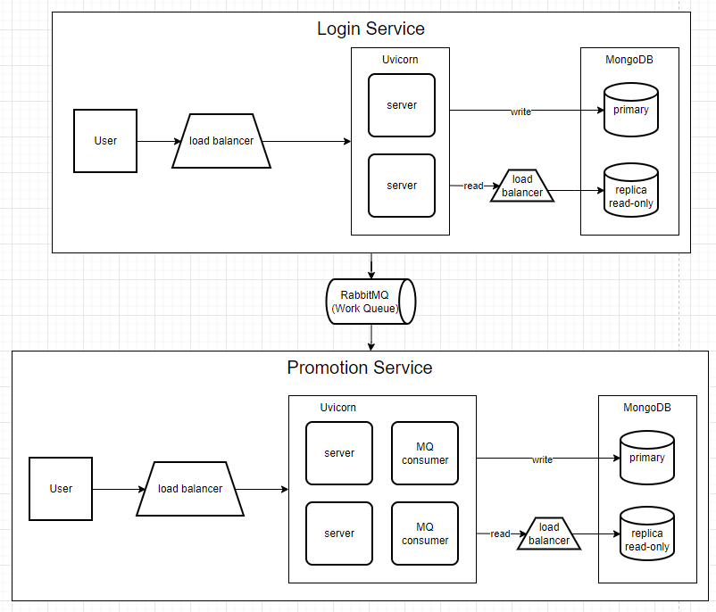

# Requirements
1. The login/create system:
    - User can create an account
    - User can login to their account
2. The promotion system:
    - The 100 first login users will get a 30% discount
    - This discount will be applied to the

# Analysis and Assumptions
1. For the login/create system:
    - Because the system serve for the bank so one user only have one account.
    - Because the system serve for the bank so the login session/token will be expired after 30 minutes, for the security reason. After that, user has to login again.
    - Because I only care about the backend, I will assume that the data send to server has beed encrypted and sent securely by TLS or the similar protocol.
2. For the promotion system:
    - There is only one campaign at a time. Because if it multiple campagain we could handle it by increasing number of users will get discount.

# Solution
* Authentication method: **JWT Token**
    - I use the token-based authentication, which will reduce the load on the server and make the system easier to scale.
    - The signature of JWT will be encrypted by asymmetric encryption (RSA), to make other service verify the token without requiring the secret key and request to the login service.
* Framework: **FastAPI**
    - I use FastAPI, because it is one of the fastest web frameworks for Python. It is also support asyncio, which is good for the system that need to handle many concurrent requests.
* Database: **MongoDB**
    - I use MongoDB, because the system doesn't need to have a complex relationship between the data, and it easy to scale horizontally.
## System Architecture

- **Server**: In order to serve 100000 users, we need to have server that can be scaled horizontally. And we also need to have a load balancer to distribute the load to the servers.
- **Database**: Because the number of write operations is less than the number of read operations, so to scale database I choose to create duplicate read-only databases and use the load balancer to distribute the read operations to the databases. And also have the support of the cache system to reduce the load on the database.
- **Message Queue**: To connect between login service and promotion service, I use the message queue to send the message from login service to promotion service.

## Data Schema
### User
```json
{
    "id": "uuid",
    "username": "string", // index
    "email": "string", // index
    "phone": "string", // index
    "password": "string",
    "full_name": "string",
    "birthday": "datetime",
    "is_active": "number",
    "is_first_login": "number",
    "created_at": "datetime",
    "updated_at": "datetime"
}
```
### Promotion Campaign
```json
{
    "id": "uuid",
    "name": "string",
    "discount": "number",
    "remaining_promotion": "number", // compostite index (is_available, remaining_promotion)
    "number_of_promotion": "number",
    "is_available": "number",
    "description": "string",
    "created_at": "datetime",
    "updated_at": "datetime"
}
```
### Voucher
```json
{
    "id": "uuid",
    "user_id": "uuid", // composite index (user_id, is_available)
    "campaign_id": "uuid",
    "description": "string",
    "expire_at": "datatime",
    "discount": "number",
    "is_available": "number",
    "created_at": "datetime",
    "updated_at": "datetime"
}
```

## Work Flow
### User create an account


### User login to their account


### Promotion service handle the first login user


### User get the promotion


# API Documentation
1. **Register**
    - **URL**: `/register`
    - **Method**: `POST`
    - **Request Body**:
    ```json
    {
        "username": "string",
        "email": "string",
        "phone": "string",
        "password": "string",
        "full_name": "string",
        "birthday": "datetime"
    }
    ```
    - **Response**:
    ```json
    { // 200 OK
        "status": "success",
    }
    { // 400 Bad Request
        "status": "error",
        "message": "error message"
    }
    ```
2. **Login**
    - **URL**: `/login`
    - **Method**: `POST`
    - **Request Body**:
    ```json
    {
        "username": "string",
        "password": "string"
    }
    ```
    - **Response**:
    ```json
    { // 200 OK
        "status": "success",
        "token": "string"
    }
    { // 400 Bad Request
        "status": "error",
        "message": "error message"
    }
    ```
3. **Get Voucher**
    - **URL**: `/voucher`
    - **Method**: `GET`
    - **Request Header**:
    ```json
    {
        "Authorization": "Bearer <token>"
    }
    ```
    - **Response**:
    ```json
    { // 200 OK
        "status": "success",
        "voucher": {
            "description": "string",
            "discount": "number",
            "expire_at": "datetime"
        }
    }
    { // 400 Bad Request
        "status": "error",
        "message": "error message"
    }
    ```
